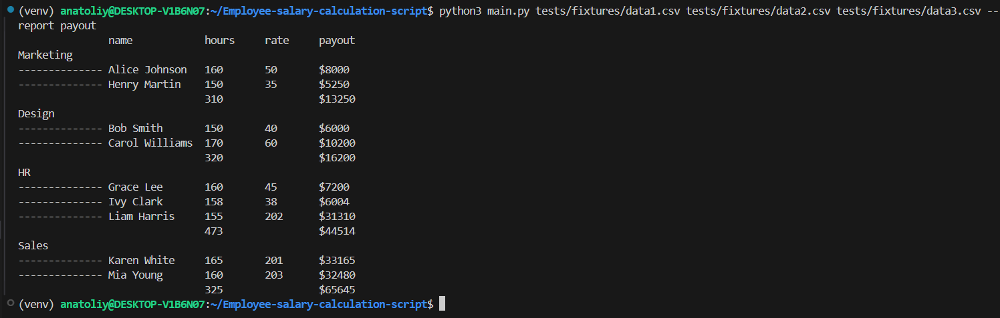

# Скрипт подсчёта зарплаты сотрудников

## Описание
Данный скрипт предназначен для чтения данных сотрудников из файлов в формате CSV и формирования отчетов по заработной плате. Он позволяет анализировать данные из нескольких файлов одновременно и может быть легко расширен для добавления новых типов отчетов в будущем.

#### Установить проект себе можно, прописав команды в командной строке:
- `git clone https://github.com/Anatoliy2610/Employee-salary-calculation-script.git`
- `make install` (установятся зависимости из файла requirements.txt)

## Как пользоваться
### Что нужно сделать
- Запустите скрипт, передав пути к файлам CSV с данными сотрудников.
- Укажите тип отчета, который необходимо сформировать с помощью параметра `--report`.

### Пример структуры файла CSV
Формат файла должен быть следующим:
```
d,email,name,department,hoursworked,hourlyrate
1,alice@example.com,Alice Johnson,Marketing,160,50
2,bob@example.com,Bob Smith,Design,150,40
3,carol@example.com,Carol Williams,Design,170,60
```

### Пример запуска скрипта
Чтобы запустить скрипт и сгенерировать отчет по зарплатам (`payout`), используйте следующую команду в командной строке:
- `python3 main.py tests/fixtures/data1.csv tests/fixtures/data2.csv tests/fixtures/data3.csv --report payout`
Где tests/fixtures/data1.csv, tests/fixtures/data1.csv, tests/fixtures/data1.csv - путь до исполняемых файлов.

#### Запустить проверки проекта можно, прописав команды в командной строке:
- `make test` (запускает тестирование)
- `make check` (запускает проверку линтера)
- `make format` (исправляет ошибки линтера)
- `isort main.py` (исправляет импорты, вместо main.py можно указать другой файл, либо директорию)

## Примеры запуска приложения


